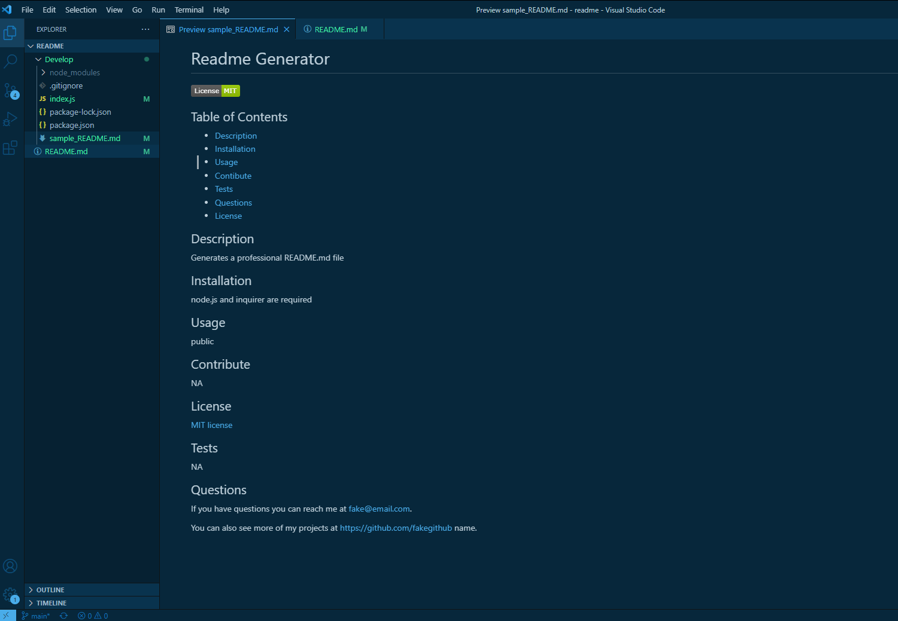

# README Generator

## Description

An app that generates a README.md file based on the responses to a few questions.

## Installation

Requires the user to download node.js and then inquirer.

Application is run from the command line.

## Image

## Video Link

[video link](https://drive.google.com/file/d/1zJrOx2poSdZE2qQDYCruw2MtkuuFu9u_/view)
